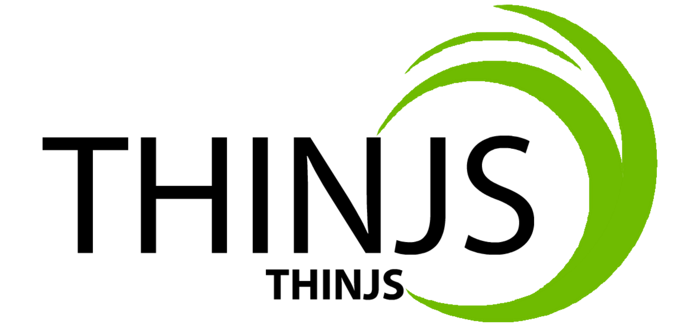

# ThinJS

README: [English](README.en.md) | [中文](README.md)

#### 介绍
极致、快速、简便的响应式JavaScript开发框架。
+ 可以有效的帮助你减少需要编写的代码量；
+ 完全开源；
+ 可扩展、易扩展；

#### 安装教程

1[1].  下载开发版本 [thinjs.js](https://github.com/joytou/ThinJS/blob/master/src/thinjs.js) 或 压缩版本 [thinjs.min.js](https://github.com/joytou/ThinJS/blob/master/src/thinjs.min.js) 文件；

1[2].  使用git clone此仓库：`git clone https://github.com/joytou/ThinJS.git`；

2[1].  使用script标签引入 _thinjs.js_ 或 _thinjs.min.js_ 文件；

3[1].  完成！

#### 使用说明

详情请参见[项目首页](http://joytouwu.gitee.io/thinjs)里面的使用方法！

#### 参与贡献

1.  Fork 本仓库
2.  新建 Feat_xxx 分支
3.  提交代码
4.  新建 Pull Request

#### 协议
__Apache License__

_Version 2.0, January 2004_

Apache Licence是著名的非盈利开源组织Apache采用的协议。该协议和BSD类似，同样鼓励代码共享和尊重原作者的著作权，同样允许代码修改，再发布（作为开源或商业软件）。需要满足的条件也和BSD类似：

1. 需要给代码的用户一份Apache Licence。
2. 如果你修改了代码，需要在被修改的文件中说明。
3. 在延伸的代码中（修改和有源代码衍生的代码中）需要带有原来代码中的协议，商标，专利声明和其他原来作者规定需要包含的说明。
4. 如果再发布的产品中包含一个Notice文件，则在Notice文件中需要带有Apache Licence。你可以在Notice中增加自己的许可，但不可以表现为对Apache Licence构成更改。

Apache Licence也是对商业应用友好的许可。使用者也可以在需要的时候修改代码来满足需要并作为开源或商业产品发布/销售。

#### 鸣谢

+ [jQuery](https://jquery.com/)
+ [Vue.js](https://vuejs.org/)
+ [MDN](https://developer.mozilla.org/)
+ [从零开始编写自己的JavaScript框架（一）](https://www.ituring.com.cn/article/48461)————[民工精髓](https://www.ituring.com.cn/space/98039)

_备注：排名不分先后_

<!--
#### 码云特技

1.  使用 Readme\_XXX.md 来支持不同的语言，例如 Readme\_en.md, Readme\_zh.md
2.  码云官方博客 [blog.gitee.com](https://blog.gitee.com)
3.  你可以 [https://gitee.com/explore](https://gitee.com/explore) 这个地址来了解码云上的优秀开源项目
4.  [GVP](https://gitee.com/gvp) 全称是码云最有价值开源项目，是码云综合评定出的优秀开源项目
5.  码云官方提供的使用手册 [https://gitee.com/help](https://gitee.com/help)
6.  码云封面人物是一档用来展示码云会员风采的栏目 [https://gitee.com/gitee-stars/](https://gitee.com/gitee-stars/)
-->
